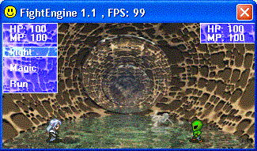



## Simple RPG Fight Engine \(1\.1\)

### Description

Just a simple rpg fight engine for one of my rpg projects...not much at all. see screenshot

-Controls: Press "S" for the menu and then use the arrow keys
 
### More Info
 

             |
---                |---
**Submitted On**   |2002-03-21 18:39:56
**By**             |[SmokingFish](https://github.com/Planet-Source-Code/PSCIndex/blob/master/ByAuthor/smokingfish.md)
**Level**          |Beginner
**User Rating**    |3.8 (19 globes from 5 users)
**Compatibility**  |VB 5\.0, VB 6\.0
**Category**       |[Games](https://github.com/Planet-Source-Code/PSCIndex/blob/master/ByCategory/games__1-38.md)
**World**          |[Visual Basic](https://github.com/Planet-Source-Code/PSCIndex/blob/master/ByWorld/visual-basic.md)
**Archive File**   |[Simple\_RPG558672182002\.zip](https://github.com/Planet-Source-Code/smokingfish-simple-rpg-fight-engine-1-1__1-31898/archive/master.zip)

### API Declarations

some. bitblt etc.

